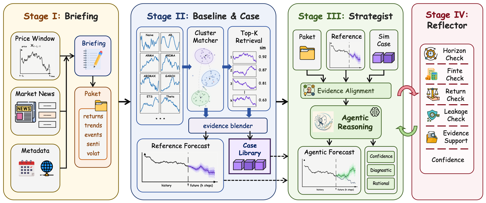

<table>
  <tr>
    <td width="190" align="center">
      
    </td>
    <td>
      <h1>FinCast: A Simple Agentic Framework for Financial Time Series Forecasting</h1>
      <p>
        
        
      </p>
    </td>
  </tr>
</table>

FinCast is a lightweight research framework for financial time series forecasting.
It combines classical forecasting models, historical case retrieval, aligned
news context, and an optional LLM Strategist to produce price-level forecasts.

<div align="center">



</div>

Given a look-back price window $X_{t-L:t}$, aligned news context $N_{t-L:t}$,
retrieved cases $\mathcal{C}_t$, and baseline proposals $\mathcal{B}_t$,
FinCast predicts:

$$
\widehat{Y}_{t+1:t+H}
= \mathcal{R}\!\left(
\mathcal{S}\!\left(X_{t-L:t}, N_{t-L:t}, \mathcal{C}_t, \mathcal{B}_t\right)
\right),
$$

where $\mathcal{S}$ is the Strategist and $\mathcal{R}$ is the Reflector.
Baseline models provide candidate trajectories; retrieved cases and recent
news help refine the final path, while the Reflector checks scale, leakage,
and financial reasonableness.

Example result on NFLX:

<div align="center">

| Model | RMSE | MAE | Directional Accuracy |
| --- | ---: | ---: | ---: |
| FinCast | 85.10 | 41.05 | 62.65% |
| HistoricAverage | 88.56 | 50.22 | 44.09% |
| SeasonalNaive | 96.79 | 42.10 | 37.57% |
| ARIMALogPrice | 97.81 | 41.47 | 35.02% |
| ARIMAXPrice | 98.24 | 41.03 | 52.12% |
| ARMAGARCHReturn | 104.39 | 46.35 | 46.89% |
| Theta | 111.22 | 43.35 | 61.32% |
| EWMAReturn | 124.81 | 53.94 | 41.32% |
| ARMAReturn | 136.21 | 50.76 | 56.38% |
| RandomWalkDrift | 136.32 | 50.42 | 57.37% |
| ARReturn | 141.62 | 52.82 | 55.04% |

</div>

## Usage

Install dependencies:

```bash
pip install -r requirements.txt
```

Build the case library:

```bash
python scripts/run_train.py
```

Run the benchmark:

```bash
python scripts/run_experiment.py
```


## Environment

Create a `.env` file if you want to use the LLM Strategist. Example only:

```env
OPENAI_API_KEY=your_api_key_here
MODEL=gpt-4.1-mini
# OPENAI_BASE_URL=https://api.openai.com/v1
```

For non-LLM experiments, set `use_llm_strategist: false` in
`scripts/experiment_config.yaml`.

## Data

The datasets are built from public stock price and news sources:

- [Massive Stock News Analysis DB for NLP Backtests](https://www.kaggle.com/datasets/miguelaenlle/massive-stock-news-analysis-db-for-nlpbacktests?resource=download)
- [6000 NASDAQ Stocks Historical Daily Prices](https://www.kaggle.com/datasets/raymondsunartio/6000-nasdaq-stocks-historical-daily-prices)

## Acknowledgements

Thanks to [AlphaCast](https://github.com/SkyeGT/AlphaCast_Official) and
[TimeSeriesScientist](https://github.com/Y-Research-SBU/TimeSeriesScientist)
for their open-source code and research work. We also thank the public data
providers and Kaggle dataset contributors for making this project possible.
